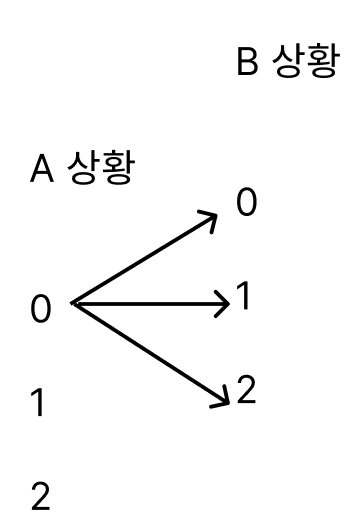

# DP topdown

```python
def topdown:
     if 마지막 노드에 다다른 조건:
           return ~~
     if 이미 DP 테이블에 값이 있다면(memoization):
           return 그냥 그거 가져온다.
     #밑에 있는 노드를 호출해서 답 갱신 + 필요하다면 DP 테이블에도 값 갱신
     DP[][] 처리(+= 또는 min .. topdown() )
     return 해당 노드값
```

# Knapsack 알고리즘
### 입력/출력값에서 힌트
- ex) 이 값은 100보다 작거나 같은 자연수이다. -> DP [][여기 해당]
- 확인하고자 하는 구슬의 무게는 40,000보다 작거나 같은 자연수이다.
- ex. 양팔저울 : 
  - 추 1로 만들 수 있는 ..
  - 추 1포함 2로 만들 수 있는 ..
  - 추 1,2포함 3으로 만들 수 있는 ..
  - ..

```python
dp[i][j]=max(dp[i−1][j],dp[i−1][j−wi]+vi])
vi: 물건의 가치
wi: 물건의 무게
dp[i][j] : 최대 이윤 (i : 현재 넣은 물건의 번호, j: 넣을 수 있는 최대 무게)
```

### init 처리 주의 -> 필터링 느낌
DP 리스트는 전부 0으로 채운 후 DP[0][0] = 1 -> 이는 가능을 뜻함.    
DP 리스트는 전부 float('inf')로 채운 후 DP[0][0]=0 -> 이는 필요한 돈의 최솟값을 구하기 위함

### DP 테이블 두 개로 왔다리 갔다리 갱신
when ? -> 한 개로 채워나가면 어떤 원하는 값 한 개가 자꾸 덮어씌워질 때

### DP 와 DFS/Dijkstra
상태값을 저장하여 최단거리 또는 dfs 수행 가능

### 점화식 먼저 고려
귀납적으로 i = 0일 때, 1일 때 .. 를 증명해보이며 규칙을 찾는다.   
또는 이러다보이면 나오는 규칙에 작은 문제부터 해결하여 큰 문제에 도달한다.

### STEP 으로 채워나가는 DP
ex) PG 사칙연산 / 백준 행렬 곰셈 순서   
```
for i in range(num): # step
   for j in range(num-i):
      if i==1: #step 1 처리
      else:
            for k in range(j,j+i): #해당 index를 채우기 위해 여러 step들에서 끌어오기

```      

### DP 최적화
DP 차원을 2,3차원으로 할수도 있지만   
1차원으로 init 으로 가장 기본 과정을 다 거친 이후   
-> 2차원, 3차원 과정을 대입해줄 수 있다.   
ex. 백준 11058
결국 복사는 3 전에 의미가 있다.
3의 배수에서는 3 전에 복사해두고 붙여넣는 것이, 3의배수 +1/+2에서는 거기에서 한 번 더/두 번 더 붙여넣기 하는 게 의미있음
Ctrl A -> Ctrl C -> Ctrl V 단계가 모두 있을 때 의미가 있으므로!


### DP 정의
- 백준 2482
DP[i][j] = i개의 색 중에서 j개의 색을 선택하는 경우의 수
- 백준 12978
DP = [[0,1] for _ in range(N + 1)] # 0-경찰서x, 1-경찰서o
- 백준 2662
DP[n만원을 투자했을 때][m까지의 기업까지 고려했을 때의] = 최대이익

### 3차원 배열
어떤 그림이 아래와 같은 형태로 뻗어나간다면 DP 의심할 만 하다.

- 백준 14722
DP[i][j][0까지|1까지|2까지]=먹었을 때 최대
맨 처음에 최단 거리 알고리즘을 떠올렸으나 -> 이건 그리디하게 다음 노드들을 선택해야 하는데   
해당 문제는 전전 노드의 영향도 받을 수 있음 ---> 이 포인트에서 DP 적절   
이 문제에서 가장 원초적인 테스트케이스 확인 필요
```
3
1 1 1
1 1 1
1 1 1
```

### [IDEA] 숫자를 추가할 때 오히려 뒷자리에서부터 추가 
뒤에서부터 생각 !
- 백준 11057

### 독립 !!
경우를 따질 때 독립적으로 생각해서 가져오는 것이 중요하다 
- PG 산모양 타일링 (카카오 코테)


### BFS가 가능하다 + 시간초과 이슈 -> DP 의심해보자 !!
