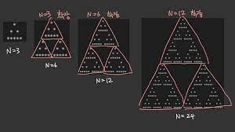

**BOJ 2448 별찍기-11**
생각 => 그림    
   
=> 로직 (분할정복, 재귀)   
12를 채우기 위해 6으로 쪼개서 나아가고   
6을 채우기 위해 3으로 쪼개서 나아간다.   

코드 구현   
```python
def conquer(i,j,n):
    if n==3:
        star[i][j-2][j+3]='*'
        star ... #나머지 처리
        return
    else:
    conquer(i,j,n//2) #재귀
    conquer(i+n//2,j-n//2,n//2) #재귀
```