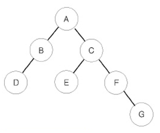

# visited 빼먹지 말기!

# DFS
### 생각 로직
노드 1의 값을 알기 위해 2, 3 탐색 후 반환   
다시 2, 3의 값을 알기 위해 각각 4, 6 / 5 탐색 후 반환 ..   
**창속의 창속의 창속의 ...**   

return 문과 bfs 문이 중요하다 재귀 호출 & 반환    

ex. [PG] 모두 0으로 만들기    
우선 이게 DFS로 해결될 수 있음을 이해하기도 빡셀 수 있음   
아래의 일련의 과정을 필요로 한다는 사실을 가지고 진행 -!!     
- 끝에 도달하면 ? -> 자기를 0으로 만들기 위해 부모에게 자기를 더해야 함.
- 그럼 각각의 노드는 무엇을 반환해야 해? -> 자신의 값을 반환
- 정답은 그 반환하는 전체 횟수가 중요함 -> abs(더하거나 빼는 행위의 값)


# BFS
- 상하좌우 이동 시 조금 더 빠르게 코드 작성하는 방법   
  - 좌표평면 속 -> x, y   
  - 행렬 속 c, r   
- 실수 줄이기 위해 변수 빼기   
```python
for i,j in [(0,1), (0,-1), (-1,0), (1,0)]: 
    nx = x+i; ny = y+j # 이렇게 빼주기 ! 
    if nx>=0 and nx<r and ny>=0 and ny<r: 
```

BFS에서 visited 배열 위 아래 둘 다 넣는 거 주의하기 !!

### 메모리초과 이슈 -> 굳이 큐 안에 여러 정보를 넣지 말자. 더 최적화하는 방법 찾기 !

### 전위 중위 후위 순회


전위 순회한 결과 : ABDCEFG // (루트) (왼쪽 자식) (오른쪽 자식)
중위 순회한 결과 : DBAECFG // (왼쪽 자식) (루트) (오른쪽 자식)
후위 순회한 결과 : DBEGFCA // (왼쪽 자식) (오른쪽 자식) (루트)
