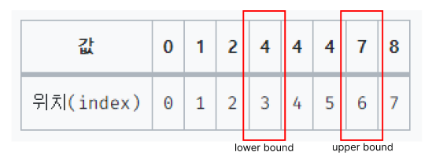

### TIP
이분 탐색의 핵심은     
|-----------------ㅇ-----|      
명확히 나누어지는 이 경계값을 찾는 것이다!   
즉 이 경계값을 찾기 위한 **비교조건**을 잘 찾자.!   

### 파이썬 upper bound, lower bound
```python
def upperbound(array, k): # k 초과 값이 처음 나오는 위치
    left = 0
    right = len(array)

    while left < right:
        mid = (left + right) // 2

		# 📢 이 부분 주의!
        if array[mid] >= k: #오른쪽으로 좁힘 -> upperbound
            right = mid
        else:
            left = mid + 1

    return left
```

```python
def lowerbound(array, k): #k 이상 값이 처음 나오는 위치
    left = 0
    right = len(array)
    
    while left < right:
        mid = (left + right) // 2
		
        # 📢 이 부분 주의!
        if array[mid] > k:
            right = mid
        else:
            left = mid + 1

    return left  
```



### 시간복잡도
N = 10만 또는 100만 일 때 유력 !
why? -> O(NlogN) 정렬을 사용해야 하므로!

### 조금 더 생각해보기
- lowerbound 로직
right = mid 로 할당하는 건 범위를 왼쪽으로 좁히는 것
근데 array[mid]가 k랑 같아도 right=mid로 왼쪽으로 계속 좁히기 때문에 lowerbound를 만족시킨다.
- upperbound 로직
array[mid]가 k와 같거나 작을 때까지 left = mid+1로 계속 오른쪽으로 보내기 때문에 left는 만족을 하게 되는 때가 오더라도 그 뒷 값을 가리킨다. 즉, upperbound를 만족시킨다.
