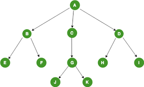

# 트리
### 정의
- 사이클이 없이 모든 정점이 연결되어 있는 그래프
- 따라서 (사이클이 없으므로) 정점의 갯수가 V개이면 간선의 갯수는 V-1이다.

### 예시

### 응용 
트리에서의 DP => DFS+DP 테이블       
|   | 1 | 2 | 3 | 4 | 5 | 6 | 7 |   
|:-:|:-:|---|---|---|---|---|---|   
| O |   |   |   |   |   |   |   |   
| X |   |   |   |   |   |   |   |   

노드 1의 DP 값을 채우기 위해 인접한 2 탐색    
    2의  ~~~                    3, 6 탐색     
...
이후 7000 또는 0 반환 후 더 재귀하지 않는다.

트리DP의 상황
- 예를 들어, 특정한 i번째 노드를 루트로 하는 서브 트리에 대해서 i번째 루트 노드를 포함했을 때와 포함하지 않았을 때 중 조건에 맞는 답을 정의한다.
- ex. BOJ 12978 